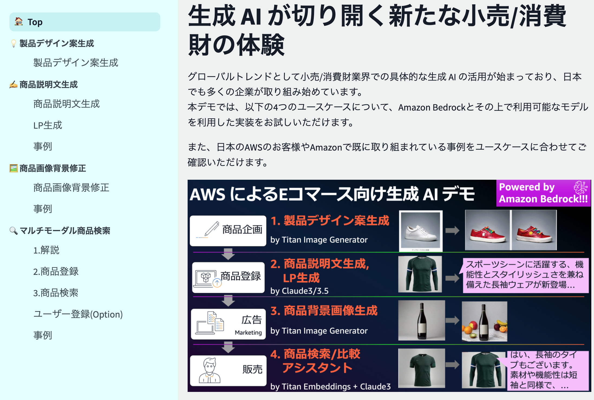

# ec-genai-demo: E コマースにおける生成AI 4大ユースケースデモ 

本デモでは、以下の E コマースにおける代表的な生成AIの 4 つのユースケースについて、 Amazon Bedrock とその上で利用可能なモデルを利用した実装をお試しいただけます。  

細かな解説は以下のブログもご参照ください。  
紹介ブログ：[生成 AI で加速する e コマースの変革 その 2 – AWS Summit Japan 2024 で展示した Amazon Bedrock デモの解説 | Amazon Web Services ブログ](https://aws.amazon.com/jp/blogs/news/aws-summit-2024-retail-cpg-ec-genai-bedrock-demo-architecture/)




## 機能紹介
次の 4 つのユースケースについての Amazon Bedrock によるデモ実装が含まれます。  

細かな解説は以下のブログもご参照ください。  
紹介ブログ：[生成 AI で加速する e コマースの変革 その 2 – AWS Summit Japan 2024 で展示した Amazon Bedrock デモの解説 | Amazon Web Services ブログ](https://aws.amazon.com/jp/blogs/news/aws-summit-2024-retail-cpg-ec-genai-bedrock-demo-architecture/)


<details>
  <summary>製品デザイン案生成</summary>


新たな製品のデザインをする際のネタとなる商品画像と、デザイン案のイメージをプロンプトとして渡すことで、製品デザイン案を複数生成する実装です。

以下の例では白いスニーカーを元画像として、「カラフルな革靴、白い紐、ハートロゴ」というデザイン案のイメージを渡すことでデザイン案を複数生成させています。

|||
|---|---|

**利用モデル**：[Amazon Titan Image Generator G1](https://docs.aws.amazon.com/ja_jp/bedrock/latest/userguide/titan-image-models.html)

**仕組み**

1. マスク画像の自動生成
    1. Titan Image Generator の [inpaint](https://docs.aws.amazon.com/ja_jp/bedrock/latest/userguide/titan-image-models.html#titanimage-parameters:~:text=%E3%81%8C%E3%81%82%E3%82%8A%E3%81%BE%E3%81%99%E3%80%82-,%E3%82%A4%E3%83%B3%E3%83%9A%E3%82%A4%E3%83%B3%E3%83%86%E3%82%A3%E3%83%B3%E3%82%B0,-%E2%80%93%20%E7%94%BB%E5%83%8F%E3%81%A8%E3%82%BB%E3%82%B0%E3%83%A1%E3%83%B3%E3%83%86%E3%83%BC%E3%82%B7%E3%83%A7%E3%83%B3) によって投稿された画像の一部領域のみを再生成します。
    2. inpaint 機能では maskPrompt でプロンプトとして修正する領域を指示することも可能ですが、輪郭を正確にマスクすることは難しいため、 [rembg](https://github.com/danielgatis/rembg) という Python ライブラリを使用してマスク画像（0/1表現の白黒画像）を生成し、商品部分である白い部分を再生成するように2値変換し Titan Image Generator にパラメーターとしてリクエストします。
2. 日本語プロンプトへの対応
    1. プロンプトを Amazon Bedrock に渡す際に Amazon Translate を利用して英訳しています。そのため、日本語プロンプトを入力しても問題なく動作します。
3. 画像生成
    1. Amazon Bedrock の Titan Image Generator モデルを使用して、ユーザーが入力したプロンプトに基づいて画像を編集 − Inpaint を利用することで、マスク部分以外の画像生成を行います

</details>

<details>
  <summary>商品説明文生成(+インスタグラム投稿案、タグ生成、カテゴリ分類)</summary>

商品画像、商品名、商品の特徴（自由入力で素材や季節、生地の厚さ等を入力）を元にその商品の分析を行い、商品説明文に含めたいトピックとして指定した項目にしたがい商品説明文を生成する実装です。
合わせて、商品カテゴリ 3 つと、インスタグラムに対する投稿原稿も生成します。

|||
|---|---|

**利用モデル**：[Anthropic Claude 3 Sonnet / Haiku](https://aws.amazon.com/jp/bedrock/claude/)（切り替え可能）

**仕組み**

1. 商品画像、商品名、商品の特徴（自由入力で素材や季節、生地の厚さ等を入力）をインプットにその商品の分析を Claude3 で実施するプロンプトを実行しています
   1. 
    ```
    <your role>あなたは、Eコマースにおける売場づくりのプロフェッショナルです。</your role>
    <instruction>
    新商品 {focus_item}の販売促進のために、Eコマースサイトでユーザーが思わず購入したくなるような魅力的な商品説明を考えてください。
    あなたが読み込んだ画像は{focus_item}の写真です。
    {focus_item}の色や種類を分析し、この商品を具体的に説明してください。商品の特徴が feature に記載されます。
    説明文の提案は step に則って作成してください。
    </instruction>
    <step>
    ステップ1: 商品の基本情報を確認する
    ステップ2: ターゲット層を設定する
    ステップ3: ターゲット層に合わせた言葉遣いやトーンを決める
    ステップ4: 概要を書く
    ステップ5: 埋めるべき各項目を書く
    ステップ6: 全体を通して推敲する
    </step>
    <feature>
    {feature}
    </feature>
    <topic>
    {topic}
    </topic>
    <constraint>
    アウトプットは topic に記載された項目に沿って記載してください。
    最後に推奨ターゲット層とそれに合わせた販売チャネルについて提案してください。
    なお、XMLタグは出力しないでください。
    </constraint>
    ```
      1. ※プロンプトには UI のテキストウィンドウで入力された変数を埋め込んています。
        1. {focus_item} に商品名、{feature} に商品特徴、{topic} に説明文に含めたい項目
   
2. ここでは以下複数の Claude に関するプロンプトテクニックを利用しています
    1. [Claudeに役割を与える](https://docs.anthropic.com/ja/docs/give-claude-a-role)：E コマースにおける売場づくりのプロフェッショナル という役割を与えています
    2. [XMLタグを使用する](https://docs.anthropic.com/ja/docs/use-xml-tags)：UI により与えられる素材等の情報を <feature></feature> タグ内に配置することで構造化します
    3. [Chain of Thought(CoT)](https://docs.anthropic.com/ja/docs/let-claude-think)：商品説明文に含まれる要素を分解可能であれば、思考ステップとして定義することでより具体的な文面生成が可能です
    4. ※詳しくは [こちら](https://docs.anthropic.com/ja/docs/prompt-engineering) の Anthropic 公式プロンプトエンジニアリングガイドを参照ください。

</details>

<details>
  <summary>LP(ランディングページ)生成</summary>

**利用モデル**：
- [Anthropic Claude 3.5 Sonnet / Claude 3 Haiku](https://aws.amazon.com/jp/bedrock/claude/)(併用)
- [Amazon Titan Image Generator G1](https://docs.aws.amazon.com/ja_jp/bedrock/latest/userguide/titan-image-models.html)

**仕組み**

1. 商品名、LP を使って訴求したいターゲット、伝えたいコンテンツを入力として受け取る
2. 以下の処理を各 LLM にて実施する
  1. 見出しリスト作成
    Claude 3 Haiku に以下プロンプト
    ```
    生成したいLPのイメージが伝わるよう、プロンプトを入力してください","""あなたはある<item></item>を訴求するランディングページを作成するメディアライターです。
    <target></target>に<item></item>を使った<contents></contents>の魅力を伝えたいです。そのためのLPの構成となる見出しリストを作成してください。
    ```
  2. ダミー情報生成
    Claude 3 Haiku に以下プロンプト。過去の履歴は、Amazon Bedrock [InvokeModel](https://boto3.amazonaws.com/v1/documentation/api/latest/reference/services/bedrock-runtime/client/invoke_model.html) API 内の[messages](https://docs.aws.amazon.com/bedrock/latest/userguide/model-parameters-anthropic-claude-messages.html) 内に含めて送信。
    ```
    実際に各セクションに、見出しと本文にダミー情報を入れてください。
    ```
  3. 画像の生成
      1. Titan Image Generator で画像を生成するためのプロンプトを Claude Sonnet で生成
        ```
        <content></content>を元に、各セクションに画像の説明をする文章を<rule></rule>に従って英語で作成してください。
        出力は<output></output>のJSON形式で出力してください。画像名は<name></name>で与えられたモノを順に利用してください。
        JSON 以外は出力しないでください。
        <content>{assistant_return_3}</content>
        <rule>
        - HTMLのタグで表現できる内容は画像にしないでください。
        - 画像の説明は{image_num}枚分作成してください。
        - 暴力的な表現や誇大広告は避けてください。
        - 生成する文章は AWS の責任ある AI ポリシーに従ってください。ポリシーのurl はhttps://aws.amazon.com/jp/machine-learning/responsible-ai/policy/ です。
        </rule>
        <name>
        {img_name_dict}
        </name>
        <output>
        {{
            'image_9e3d82f':'ここに画像の説明をする文章を英語で入力します。画像生成 AI のプロンプトに沿った形式で入力してください。'
        }}
        </output>
        ```
  4. 生成された情報をまとめて、LPを生成
    ```
    <content></content>を元に、LP を作成してください。
    デザインは添付の画像を参考にして作成してください。
    作成には<rule></rule>に従ってください。HTML と Style のみを出力してください。それ以外は出力しないでください。
    <rule>
    - 出力はHTMLと、それを修飾するためのStyleのみを出力してください。
    - 画像のタグは のように作成してください。
    - <images></images>の画像から選択し、同じ画像は使わないようにしてください。
    - 画像のタグは {len(image_dict)} つ作成してください。'''
    </rule>
    <images>
    {image_dict}
    </images>
    <content>{assistant_return_3}</content>
    ```


|||
|---|---|

</details>

<details>
  <summary>商品画像背景修正</summary>


元商品画像をアップロードしイメージを指示することで、商品画像や広告画像を用意する際の背景生成案を複数生成する実装です。

以下の例ではワインボトルを元画像として、以下のようなイメージを渡すことで背景生成案を複数生成させています。

```
プロのカメラマンが撮影した商品画像、大理石のテーブルの上に、たくさんの果物が置かれている、背景は少しボケている
```

|||
|---|---|

**利用モデル**：[Amazon Titan Image Generator G1](https://docs.aws.amazon.com/ja_jp/bedrock/latest/userguide/titan-image-models.html)

**仕組み**

1. マスク画像の自動生成
    1. Titan Image Generator の [inpaint](https://docs.aws.amazon.com/ja_jp/bedrock/latest/userguide/titan-image-models.html#titanimage-parameters:~:text=%E3%81%8C%E3%81%82%E3%82%8A%E3%81%BE%E3%81%99%E3%80%82-,%E3%82%A4%E3%83%B3%E3%83%9A%E3%82%A4%E3%83%B3%E3%83%86%E3%82%A3%E3%83%B3%E3%82%B0,-%E2%80%93%20%E7%94%BB%E5%83%8F%E3%81%A8%E3%82%BB%E3%82%B0%E3%83%A1%E3%83%B3%E3%83%86%E3%83%BC%E3%82%B7%E3%83%A7%E3%83%B3) によって投稿された画像の一部領域のみを再生成します。
    2. inpainnt 機能では maskPrompt でプロンプトとして修正する領域指示も可能ですが、輪郭を正確にマスクすることは難しいため、 [rembg](https://github.com/danielgatis/rembg) という Python ライブラリを使用してマスク画像（0/1表現の白黒画像）を生成し、商品部分である白い部分を再生成するように2値変換し Titan Image Generator にパラメーターとしてリクエストします。
        1. ※「1. 製品デザイン案生成」と同様の実装ですが、マスク画像を2値化する際に、背景か商品かどちらを 0 にするかのみが異なります。


2. 日本語プロンプトへの対応
    1. プロンプトを Amazon Bedrock に渡す際に Amazon Translate を利用して英訳しています。そのため、日本語プロンプトを入力しても問題なく動作します。
3. 画像生成
    1. Amazon Bedrock の Titan Image Generator モデルを使用して、ユーザーが入力したプロンプトに基づいて画像を編集 − Inpaint を利用することで、マスク部分以外の画像生成を行います

</details>

<details>
  <summary>マルチモーダル/セマンティック商品検索</summary>

商品説明文や商品画像をベクトル DB にベクトルとして格納し、商品検索時に入力したテキストや画像と意味的に近いものを取得できる、マルチモーダル検索/セマンティック検索の実装です。
加えて、商品検索結果について、検索者のペルソナに合わせて説明文をパーソナライズして生成します。

|||
|---|---|
※「健康でヘルシーなご飯」に意味合いの近い、和食やそばが検索結果上位に来ており、セマンティックサーチができていることがわかります

**利用モデル**：[Anthropic Claude 3 Haiku](https://aws.amazon.com/jp/bedrock/claude/), [Amazon Titan Multimodal Embeddings G1](https://docs.aws.amazon.com/ja_jp/bedrock/latest/userguide/titan-multiemb-models.html)

**仕組み**


* 事前データ投入
    * 商品説明文、商品画像についてAmazon Titan Multimodal Embeddings G1 モデルによりベクトルが計算され、ベクトル DB である FAISS に格納されます
* 商品検索
    * 検索時に検索ワードや投稿画像をAmazon Titan Multimodal Embeddings G1でベクトル化し、あらかじめ格納されている商品のベクトルと比較した際のコサイン類似度をもとに、類似度の降順に並べられた商品一覧をFAISSから取得します
    * 商品一覧が表示される際には、検索窓に入力されたテキストと検索者のペルソナ（年齢や性別、趣味等）情報を考慮して Amazon Bedrock Claude 3 Haiku がユーザへのメッセージを生成、表示します
* 商品比較
    * 検索窓に入力されたテキストと検索者のペルソナ（年齢や性別、趣味等）の情報を考慮して Amazon Bedrock Claude 3 Sonnet が商品一覧トップの商品と他の商品との比較説明を生成、表示します


  


</details>

<details>
  <summary>商品説明文生成とLP生成の Dify Workflow</summary>

[README](dify/README.md)

</details>


### デモ
こちらのデモについて 2024/7/24 の AWS Expert Online  for JAWS-UG #34 にて、動画付きで紹介しました。  
[](https://youtu.be/6Ud6GgnrU6o?t=840)


## アーキテクチャ
アーキテクチャは非常にシンプルで、Amazon ECS 上に Steamlit で実装された簡易的な Web アプリケーションがデプロイされており、CloudFront -> Application Load Balancer 経由 で HTTPS にてアクセスが可能です。

Steamlit 上の Python スクリプトにより、Amazon Bedrock の API を呼び出し、各種生成 AI のプロンプト実行と結果の取得を行います。
モデルは、画像生成には Amazon Titan Image Generator G1、テキスト処理の LLM には Anthropic Claude 3/3.5 Sonnet/Haiku、検索時のベクトル化（Embedding）には、 Amazon Titan Multimodal Embeddings G1 を Amazon Bedrock の API から利用しています。

  


## デプロイ
> [!IMPORTANT]  
> このリポジトリでは、Amazon Bedrock のモデルとしてオレゴンリージョン (us-west-2) の以下モデルを利用する設定になっています。  
> - Amazon
>   - Titan Image Generator G1
>   - Titan Multimodal Embeddings G1
> - Anthropic 
>   - Claude 3.5 Sonnet
>   - Claude 3 Sonnet
>   - Claude 3 Haiku  
> 
> 事前に本サンプルをデプロイするアカウントにて、[Model access 画面 (us-west-2)](https://us-west-2.console.aws.amazon.com/bedrock/home?region=us-west-2#/modelaccess)を開き、モデルアクセスにチェックして Save changes してください。


まず以下のコマンドで`cdk`ディレクトリに移動し、セットアップします。  

```bash
cd cdk
npx projen install
```

> [!IMPORTANT]  
> デプロイには [AWS Cloud Development Kit](https://aws.amazon.com/jp/cdk/)（以降 CDK）と [Projen](https://github.com/projen/projen) を利用します。  
> Projen と CDK については以下 AWS ブログも参考にしてください。  
> https://aws.amazon.com/jp/blogs/news/getting-started-with-projen-and-aws-cdk/  

CDK を利用したことがない場合、初回のみ [Bootstrap](https://docs.aws.amazon.com/ja_jp/cdk/v2/guide/bootstrapping.html) 作業が必要です。  
※すでに Bootstrap された環境では以下のコマンドは不要です。

```bash
npx cdk bootstrap
```

続いて、以下コマンドで、AWS リソースをデプロイします。デプロイが完了するまで、お待ちください。  
※大体15分ほどかかります。  
```bash
npx projen build
npx projen deploy
```

## 開発
ローカル環境にて、コンテナか poetry にて環境構築が可能です。  
ローカル環境からは、Amazon Bedrock や Amazon Translate を呼び出せる権限を持っている必要があります  

### ローカルのコンテナで動かす場合

環境変数でアクセスキーを設定

```bash
export AWS_ACCESS_KEY_ID=xxx
export AWS_SECRET_ACCESS_KEY=xxx
```

Docker composeにて起動
```bash
cd src
docker compose up
```

### ローカルの poetry で動かす場合

> [!IMPORTANT]  
> pythonバージョンは poetry の `pyproject.toml` にあるように、 `">=3.12,<3.13"` を前提としています。  
> poetry の仮想環境機能を利用するため、既存の Python とは衝突しません。 

以下のように poetry で環境構築が可能です。  
```
poetry config virtualenvs.in-project true
poetry install

# .venvで仮想環境が利用可能です。
source .venv/bin/activate
```

`.env.example` ファイルを `.env` にリネームし、AWS の認証情報を設定します。
```
# EC2 や Cloud9 の IAM ロールを利用する場合は .env の設定は不要です
cp .env.example .env
```

環境構築後、以下のコマンドで Streamlit を起動します。

```
source .venv/bin/activate
region=us-west-2 poetry run streamlit run app.py
```

## お客様事例
### [株式会社オズビジョン](https://www.oz-vision.co.jp)


生成AIによる検索体験向上の検討にあたって、本サンプル ec-genai-demo を活用。ベクトル検索デモ機能に自社データを登録し、PoCを実施いただいた。  
- [ポイントモール「ハピタス」で生成AIを活用した次世代広告検索機能をリリース | NEWS | OZVISION - 株式会社オズビジョン](https://www.oz-vision.co.jp/news/835/)
- [株式会社オズビジョン様の AWS 生成 AI 事例 : Amazon Bedrock と Amazon Aurora によるポイント対象広告検索機能 | Amazon Web Services ブログ](https://aws.amazon.com/jp/blogs/news/gen-ai-usecase-ozvision/)

## Requests & Issues
ご要望や問題があれば [Issue](https://github.com/aws-samples/ec-genai-demo/issues) に起票をお願いします。  

## Security

See [CONTRIBUTING](CONTRIBUTING.md#security-issue-notifications) for more information.

## License

This library is licensed under the MIT-0 License. See the LICENSE file.

